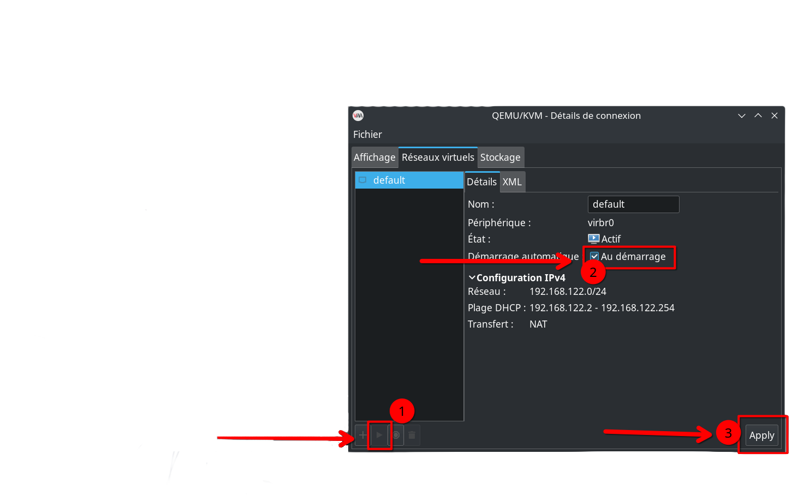

# Installation of KVM, QEMU, and Virt-Manager on Arch Linux, Debian, Ubuntu, and Fedora

This repository contains **either** a Bash script or a guide to install and configure KVM (Kernel-based Virtual Machine), QEMU, and Virt-Manager on systems based on **Arch Linux, Manjaro, Debian, Ubuntu, and Fedora**.

## Table of Contents

- [Prerequisites](#prerequisites)
- [Installation with the Script](#installation-with-the-script)
  - [What the Script Does](#what-the-script-does)
- [Manual Installation](#manual-installation)
  - [Installation of Required Packages](#installation-of-required-packages)
  - [Configuration of the `libvirtd` Service](#configuration-of-the-libvirtd-service)
  - [Configuration of Permissions](#configuration-of-permissions)
  - [System Reboot](#system-reboot)
- [After the Script](#after-the-script)
- [Firewall and Security](#firewall-and-security)

## Prerequisites

- A system based on Arch Linux, Ubuntu, Debian, or Fedora with sudo access.
- An active internet connection to download the necessary packages.
- Git installed on your system:
  - Archlinux / Manjaro: `sudo pacman -S git`
  - Fedora: `sudo dnf install -y git`
  - Debian / Ubuntu: `sudo apt update && sudo apt install -y git`
- Your processor must support virtualization (Intel VT-x or AMD-V).
- Intel VT-x or AMD-V virtualization must be enabled in the BIOS.

## Installation with the Script

Clone the repository and execute the installation script:

```bash
git clone https://github.com/Cardiacman13/kvm-qemu-virt-manager.git
cd kvm-qemu-virt-manager
chmod +x install.sh
sudo ./install.sh
```

### What the Script Does

1. **System Update**: Updates the packages on your system to ensure all dependencies are current.
2. **Package Installation**: Installs QEMU, Virt-Manager, and other necessary tools for VM management.
3. **Permission Configuration**: Configures `/etc/libvirt/libvirtd.conf` to allow the current user to manage VMs and adds the user to the `libvirt` group.
4. **Restarting Necessary Services**: Restarts the services so that the changes take effect immediately.

## Manual Installation

### Installation of Required Packages

Install the necessary packages for KVM, QEMU, and other virtualization management tools:

Archlinux:

```bash
sudo pacman -S qemu-full virt-manager virt-viewer dnsmasq vde2 bridge-utils openbsd-netcat dmidecode libguestfs
```

Fedora:

```bash
sudo dnf install -y @virtualization
```

Debian / Ubuntu:

```bash
sudo apt update
sudo apt install -y virt-manager
```

### Configuration of the `libvirtd` Service

Enable and start the `libvirtd` service:

```bash
sudo systemctl enable --now libvirtd.service
```

### Configuration of Permissions

Modify the configurations to allow the user to use KVM:

```bash
sudo sed -i 's/#unix_sock_group = "libvirt"/unix_sock_group = "libvirt"/' /etc/libvirt/libvirtd.conf
sudo sed -i 's/#unix_sock_rw_perms = "0770"/unix_sock_rw_perms = "0770"/' /etc/libvirt/libvirtd.conf
sudo systemctl restart libvirtd.service
```

Add your user to the `libvirt` and `kvm` groups:

```bash
sudo usermod -a -G libvirt $(whoami)
sudo usermod -a -G kvm $(whoami)
```

### System Reboot

After completing the configuration, it is recommended to reboot your system so that all changes take effect:

```bash
sudo reboot
```

## After the Script

You will just need to activate the connection as shown in the screenshot below, and you are ready to create a VM.



## Firewall and Security

Firewalls can sometimes block the connections necessary for the proper functioning of KVM, QEMU, and Virt-Manager. Ensure that the firewall rules allow the following connections:

- **TCP/UDP Ports**: The ports used by `libvirtd` and virtual machines must be open.
- **Specific Services**: Allow the `libvirtd` and `virt-manager` services in your firewall.

To configure the firewall, you can use tools like `ufw` (Uncomplicated Firewall) on Debian/Ubuntu or `firewalld` on Fedora. Here are some example commands:

### UFW (Debian/Ubuntu)

```bash
sudo ufw allow libvirtd
sudo ufw allow virt-manager
sudo ufw reload
```

### Firewalld (Fedora)

```bash
sudo firewall-cmd --add-service=libvirt --permanent
sudo firewall-cmd --add-service=virt-manager --permanent
sudo firewall-cmd --reload
```

By following these steps, you should be able to correctly configure your environment to use KVM, QEMU, and Virt-Manager without being blocked by firewall rules.
